# 🗄️ DIAGRAMA MODELO DE DATOS SIMBIOMA v4.0 FINAL

## Sistema Híbrido: Subscripciones + Versionado + Transparencia

```mermaid
erDiagram
    
    %% ===================================================
    %% ORGANIZACIONES
    %% ===================================================
    
    GOBIERNO_LOCAL {
        uuid id PK
        varchar tipo
        uuid gobierno_regional_id FK
        uuid subscription_plan_id FK
        boolean is_active
    }
    
    ACTORS {
        uuid id PK
        varchar actor_type
        uuid headquarters_gobierno_local_id FK
        uuid_array operates_in_gobierno_local_ids
        varchar industry_sector
        uuid subscription_plan_id FK
        boolean is_active
    }
    
    USERS {
        uuid id PK
        varchar organization_type
        uuid organization_id FK
        varchar electronic_signature_cert "ENCRYPTED"
    }
    
    %% ===================================================
    %% INDICADORES - NÚCLEO DEL SISTEMA v4.0
    %% ===================================================
    
    INDICATORS {
        uuid id PK
        varchar namespace "global | mining | empresa-X"
        varchar code_alpha UK
        integer version
        varchar name
        varchar creator_type
        uuid creator_id FK
        uuid parent_indicator_id FK "Versión anterior"
        uuid superseded_by_indicator_id FK "Versión siguiente"
        text version_notes
        date valid_from
        date valid_until
        varchar_array tags
        varchar_array industry_sectors
        varchar approval_status "draft | active | superseded | archived"
        integer subscriptions_count
        integer values_count
        timestamp last_used_at
        jsonb metadata
    }
    
    ORGANIZATION_INDICATOR_SUBSCRIPTIONS {
        uuid id PK
        varchar organization_type
        uuid organization_id FK
        uuid indicator_id FK
        varchar subscription_status "active | deprecated_for_us | pending_migration | replaced_by"
        uuid replaced_by_indicator_id FK
        date active_from
        date active_until
        integer values_count
        boolean is_primary
        text usage_notes
    }
    
    INDICATOR_RECOMMENDATIONS {
        uuid id PK
        varchar target_type "industry_sector | organization_size | region | all"
        varchar target_value
        uuid indicator_id FK
        varchar recommendation_level "required | highly_recommended | suggested | optional"
        decimal adoption_rate
        text reason
    }
    
    INDICATOR_AGGREGATION_RULES {
        uuid id PK
        uuid indicator_id FK
        varchar aggregation_behavior
        integer min_entities_for_aggregation
    }
    
    INDICATOR_VALUES {
        uuid id PK
        varchar owner_type
        uuid owner_id FK
        uuid indicator_id FK
        decimal value
        date period_start
        date period_end
        integer version
        boolean is_current
        uuid superseded_by_id FK
    }
    
    INDICATOR_MIGRATION_REQUESTS {
        uuid id PK
        varchar organization_type
        uuid organization_id FK
        uuid from_indicator_id FK
        uuid to_indicator_id FK
        varchar status "pending | in_progress | completed"
        integer values_migrated_count
    }
    
    METAS {
        uuid id PK
        varchar owner_type
        uuid owner_id FK
        uuid indicator_id FK
        decimal target_value
    }
    
    %% ===================================================
    %% FUENTES DE DATOS
    %% ===================================================
    
    DATA_SOURCES {
        uuid id PK
        varchar scope
        text api_key_encrypted "ENCRYPTED"
    }
    
    ORGANIZATION_DATA_SOURCE {
        uuid id PK
        varchar organization_type
        uuid organization_id FK
        uuid data_source_id FK
        jsonb indicator_mapping
    }
    
    %% ===================================================
    %% DOCUMENTOS Y PROYECTOS
    %% ===================================================
    
    STRATEGIC_DOCUMENTS {
        uuid id PK
        varchar owner_type
        uuid owner_id FK
        uuid parent_document_id FK
        varchar electronic_signature_url "ENCRYPTED"
    }
    
    PROJECTS {
        uuid id PK
        varchar owner_type
        uuid owner_id FK
        uuid parent_project_id FK
        boolean requires_financial_breakdown
        varchar electronic_signature_url "ENCRYPTED"
    }
    
    PROJECT_FINANCIAL_BREAKDOWN {
        uuid id PK
        uuid project_id FK
        varchar expense_category
        decimal amount_allocated_clp
        decimal amount_executed_clp
        boolean is_public
    }
    
    PROJECT_GOBIERNO_LOCAL {
        uuid id PK
        uuid project_id FK
        uuid gobierno_local_id FK
        varchar role
    }
    
    PROJECT_ACTOR {
        uuid id PK
        uuid project_id FK
        uuid actor_id FK
        varchar contract_signature_url "ENCRYPTED"
    }
    
    REPORTS {
        uuid id PK
        varchar owner_type
        uuid owner_id FK
        uuid parent_report_id FK
        varchar electronic_signature_url "ENCRYPTED"
    }
    
    %% ===================================================
    %% AUDITORÍA Y SUSCRIPCIONES
    %% ===================================================
    
    AUDIT_LOGS {
        uuid id PK
        varchar organization_type
        uuid organization_id FK
        uuid user_id FK
        timestamp created_at "INMUTABLE"
    }
    
    SUBSCRIPTION_PLANS {
        uuid id PK
        varchar sector "private | public"
        integer max_custom_indicators
    }
    
    BILLING_HISTORY {
        uuid id PK
        varchar organization_type
        uuid organization_id FK
        uuid subscription_plan_id FK
        varchar electronic_invoice_url "ENCRYPTED"
    }
    
    WAITLIST {
        uuid id PK
        varchar email UK
        varchar organization_type
    }
    
    %% ===================================================
    %% RELACIONES - SISTEMA DE SUBSCRIPCIONES v4.0
    %% ===================================================
    
    %% Jerarquía Organizacional
    GOBIERNO_LOCAL ||--o{ GOBIERNO_LOCAL : "GORE-municipios"
    GOBIERNO_LOCAL ||--o{ ACTORS : "headquarters"
    GOBIERNO_LOCAL ||--o{ USERS : "polimórfico"
    ACTORS ||--o{ USERS : "polimórfico"
    
    %% NÚCLEO: Sistema de Indicadores con Subscripciones
    INDICATORS ||--o| INDICATORS : "parent-version"
    INDICATORS ||--o| INDICATORS : "superseded-by"
    GOBIERNO_LOCAL ||--o{ INDICATORS : "crea-custom"
    ACTORS ||--o{ INDICATORS : "crea-custom"
    
    INDICATORS ||--|| INDICATOR_AGGREGATION_RULES : "regla-agregación"
    INDICATORS ||--o{ INDICATOR_RECOMMENDATIONS : "recomendaciones"
    
    %% CRÍTICO: Subscripciones (N:N con estado por relación)
    INDICATORS ||--o{ ORGANIZATION_INDICATOR_SUBSCRIPTIONS : "suscripciones"
    GOBIERNO_LOCAL ||--o{ ORGANIZATION_INDICATOR_SUBSCRIPTIONS : "polimórfico"
    ACTORS ||--o{ ORGANIZATION_INDICATOR_SUBSCRIPTIONS : "polimórfico"
    ORGANIZATION_INDICATOR_SUBSCRIPTIONS }o--o| INDICATORS : "replaced-by"
    
    %% Migraciones de versiones
    INDICATORS ||--o{ INDICATOR_MIGRATION_REQUESTS : "from"
    INDICATORS ||--o{ INDICATOR_MIGRATION_REQUESTS : "to"
    GOBIERNO_LOCAL ||--o{ INDICATOR_MIGRATION_REQUESTS : "polimórfico"
    ACTORS ||--o{ INDICATOR_MIGRATION_REQUESTS : "polimórfico"
    
    %% Valores (valida subscripción activa)
    INDICATORS ||--o{ INDICATOR_VALUES : "valores"
    GOBIERNO_LOCAL ||--o{ INDICATOR_VALUES : "polimórfico"
    ACTORS ||--o{ INDICATOR_VALUES : "polimórfico"
    INDICATOR_VALUES }o--o| INDICATOR_VALUES : "superseded-by"
    
    %% Metas
    INDICATORS ||--o{ METAS : "metas"
    GOBIERNO_LOCAL ||--o{ METAS : "polimórfico"
    ACTORS ||--o{ METAS : "polimórfico"
    
    %% Fuentes de Datos
    DATA_SOURCES ||--o{ ORGANIZATION_DATA_SOURCE : "conecta"
    GOBIERNO_LOCAL ||--o{ ORGANIZATION_DATA_SOURCE : "polimórfico"
    ACTORS ||--o{ ORGANIZATION_DATA_SOURCE : "polimórfico"
    
    %% Documentos
    GOBIERNO_LOCAL ||--o{ STRATEGIC_DOCUMENTS : "polimórfico"
    ACTORS ||--o{ STRATEGIC_DOCUMENTS : "polimórfico"
    STRATEGIC_DOCUMENTS }o--o| STRATEGIC_DOCUMENTS : "parent"
    
    %% Proyectos
    GOBIERNO_LOCAL ||--o{ PROJECTS : "polimórfico"
    ACTORS ||--o{ PROJECTS : "polimórfico"
    PROJECTS }o--o| PROJECTS : "parent"
    PROJECTS ||--o{ PROJECT_FINANCIAL_BREAKDOWN : "desglose"
    PROJECTS ||--o{ PROJECT_GOBIERNO_LOCAL : "territorios"
    PROJECTS ||--o{ PROJECT_ACTOR : "actores"
    
    %% Reportes
    GOBIERNO_LOCAL ||--o{ REPORTS : "polimórfico"
    ACTORS ||--o{ REPORTS : "polimórfico"
    REPORTS }o--o| REPORTS : "parent"
    
    %% Suscripciones
    GOBIERNO_LOCAL }o--|| SUBSCRIPTION_PLANS : "plan"
    ACTORS }o--|| SUBSCRIPTION_PLANS : "plan"
    GOBIERNO_LOCAL ||--o{ BILLING_HISTORY : "polimórfico"
    ACTORS ||--o{ BILLING_HISTORY : "polimórfico"
    SUBSCRIPTION_PLANS ||--o{ BILLING_HISTORY : "facturado"
    
    %% Auditoría
    GOBIERNO_LOCAL ||--o{ AUDIT_LOGS : "polimórfico"
    ACTORS ||--o{ AUDIT_LOGS : "polimórfico"
    USERS ||--o{ AUDIT_LOGS : "acción"
```



---

## 📊 ESTADÍSTICAS v4.0

**Total Tablas:** 22 (+2 vs v3.1)

- `organization_indicator_subscriptions` (NUEVA - crítica)
- `indicator_recommendations` (NUEVA)
- `indicator_migration_requests` (NUEVA)

**Tablas Modificadas:** 2

- `indicators` → +namespace, +version, +versionado, +tags
- `indicator_values` → Validación subscripción activa

**Relaciones Clave:**

- ✅ Versionado: indicators → parent → superseded_by
- ✅ Subscripciones: N:N con estado por relación
- ✅ Migraciones: Tracking cambios de versión

---

## 🎯 DIFERENCIAS VISUALES vs v3.1

### **ANTES (v3.1):**

```
indicators → indicator_values
(Relación directa, un catálogo global)
```

### **AHORA (v4.0):**

```
indicators (catálogo universal)
    ↓
organization_indicator_subscriptions (cada org elige)
    ↓
indicator_values (versión específica)
```

---

## 🔑 CONCEPTOS CLAVE VISUALIZADOS

### **1. Versionado de Indicadores**

```
PM2.5 v1 ←──parent──┐
     ↓              │
superseded_by       │
     ↓              │
PM2.5 v2 ──────────┘
```

### **2. Subscripciones Multi-Estado**

```
Empresa A → Indicador X (status: active)
Empresa B → Indicador X (status: deprecated_for_us)
Indicador X → Permanece en catálogo (approval_status: active)
```

### **3. Migración de Versiones**

```
Empresa solicita migrar:
  from_indicator: PM2.5 v1
  to_indicator: PM2.5 v2
  
Sistema:
  1. Depreca subscripción v1
  2. Crea subscripción v2
  3. (Opcional) Migra valores históricos
```

---

## ✅ VALIDACIÓN VISUAL

**Verifica en el diagrama:**

1. ✅ `indicators` tiene auto-relaciones (parent, superseded_by)
2. ✅ `organization_indicator_subscriptions` conecta orgs con indicators
3. ✅ `indicator_recommendations` conecta indicators con targets
4. ✅ `indicator_migration_requests` conecta 2 indicators
5. ✅ Todas las relaciones polimórficas están marcadas

---
